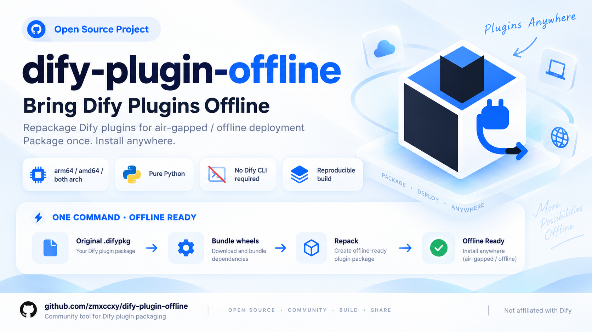

<p align="center">
  
</p>

<div align="center">


# dify-plugin-offline

**将 Dify 插件（.difypkg）重打包为内网离线安装包** · **Repackage Dify plugins for air-gapped / offline deployment**

[](https://www.python.org/)
[](LICENSE)
[](#compatibility)
[](https://github.com/zmxccxy/dify-plugin-offline)
[](https://github.com/zmxccxy/dify-plugin-offline/releases)
[](https://github.com/zmxccxy/dify-plugin-offline/commits/main)
[](https://github.com/zmxccxy/dify-plugin-offline/graphs/contributors)

[简体中文](README.md) | **English**

</div>

## What problem does it solve

Dify installs a plugin by having its plugin daemon (`plugin_daemon`) create a fresh Python
virtual environment and install the plugin's dependencies with `uv pip install` /
`uv sync` — which **requires network access to PyPI**. On intranet servers (air-gapped,
government, enterprise, or lab environments) plugin installation therefore fails.

**dify-plugin-offline** turns any existing plugin `.difypkg` into a **self-contained offline
package**: every dependency wheel is bundled inside the package, and the daemon installs
everything from local files — **no network needed at install time**.

Born from a real-world case: installing the official `openai_api_compatible` plugin on an
ARM64 intranet Dify 1.17.0 server.

## How it works

```
original .difypkg
      │
      ▼  1. unzip
plugin source + requirements.txt + pyproject.toml + uv.lock
      │
      ▼  2. pip download (per target arch: arm64 / amd64, manylinux2014 + manylinux_2_28,
      │     Python version read from manifest.yaml → meta.runner.version)
deps/*.whl
      │
      ▼  3. rewrite requirements.txt  →  ./deps/xxx.whl
      │     (--arch both adds platform_machine markers)
      ▼  4. remove pyproject.toml & uv.lock
      │     → forces the daemon onto the requirements.txt (local) path
      ▼  5. re-zip (deterministic, fixed timestamps)
<name>-<arch>-offline.difypkg
      │
      ▼  6. optional verification
uv pip install --dry-run --offline -r requirements.txt   ← same command the daemon uses
```

> Why remove `pyproject.toml`? When a plugin package contains `pyproject.toml`, the daemon
> prefers `uv sync --frozen`, which resolves from the network. Removing it (and `uv.lock`)
> forces the daemon to install from the bundled `requirements.txt` — fully offline.

## Features

- 🌍 **Cross-platform**: pure Python 3 stdlib + `pip`; runs identically on macOS, Windows and Linux
- 🏗️ **Multi-arch**: `arm64`, `amd64`, or `both` (one universal package, wheel selected at
  install time via `platform_machine` markers)
- 🪞 **Configurable pip sources**: official PyPI, Aliyun, Tsinghua, Tencent, USTC, or any
  custom index (e.g. an internal Nexus/Artifactory)
- 📋 **Robust failure handling**: whole-file download first, then automatic per-package
  retry; every failed dependency is logged individually, the run ends with exit code 1 and
  never produces a half-baked package
- 📝 **Full logging**: console + `build-offline-pkg.log`, timestamped, every retry recorded
- ✅ **Built-in verification**: replicates the daemon's exact install command with
  `uv pip install --dry-run --offline` when `uv` is available
- 🔏 **Reproducible**: fixed zip timestamps → identical SHA256 on re-runs
- 🚫 **No Dify CLI required**: the tool repackages an *existing* `.difypkg` (pure zip
  manipulation + `pip download`)

## Requirements

| Item | Requirement |
| ---- | ----------- |
| Python | 3.8+ with `pip` (the wheels are downloaded by that same pip) |
| Network | the build machine must reach the chosen pip index |
| Input | a valid Dify plugin `.difypkg` that **contains `requirements.txt`** (official marketplace / GitHub release packages all do) |
| Optional | `uv` for the offline-resolution verification step (`pip install uv`) |

## Compatibility

The tool uses only the Python standard library plus `pip`, with no shell commands or
OS-specific paths, and runs on all major desktop OSes:

| OS | Status |
| -- | ------ |
| macOS (arm64) | ✅ tested — full flow, arm64 & both-arch builds |
| Linux (amd64) | ✅ tested — full flow in a Debian container, incl. `uv --offline` verification |
| Linux (arm64) | ✅ same code path as the tested builds above |
| Windows | ✅ compatible by design (stdlib only, UTF-8 console handling, `\`/`/` path handling); machine-testing welcome — please open an issue if anything breaks |

Windows invocation: `python build-offline-pkg.py ...` (or `py -3 ...`).

> ⚠️ **Version notice**: currently validated against **Dify 1.17.0** (plugin-daemon 0.6.x); other Dify versions are **not guaranteed** to be compatible.

## Quick start

```bash
# 1. put the original plugin package next to the script
cp ~/Downloads/openai_api_compatible-0.0.65.difypkg .

# 2. build — default: arm64, official PyPI
python3 build-offline-pkg.py

# 3. result
#    openai_api_compatible-0.0.65-arm64-offline.difypkg
#    openai_api_compatible-0.0.65-arm64-offline.difypkg.sha256
```

Windows (cmd / PowerShell):

```powershell
python build-offline-pkg.py --arch amd64 --pip-source tsinghua
```

## Usage

```
python3 build-offline-pkg.py [options]
```

| Option | Values | Description |
| ------ | ------ | ----------- |
| `--input` | path | Original `.difypkg` (default: auto-detect a non-`-offline` `.difypkg` in the script directory) |
| `--arch` | `arm64` / `amd64` / `both` | Target server architecture (default `arm64`). `both` = one universal package, roughly double the size |
| `--pip-source` | `official` / `aliyun` / `tsinghua` / `tencent` / `ustc` | PyPI index for downloading wheels (default `official`) |
| `--pip-index-url` | URL | Custom index (takes priority over `--pip-source`, e.g. internal Nexus/Artifactory) |
| `--python-version` | e.g. `3.12` | Python version of the wheels (default: `meta.runner.version` from `manifest.yaml`, fallback 3.12) |
| `--retries` | int | Retries per download action (default 3) |
| `--no-verify` | — | Skip the `uv` offline-resolution verification |
| `--log-file` | path | Log file (default `build-offline-pkg.log` next to the script) |
| `--verbose` | — | Debug-level console output (the log file always records everything) |

Output naming: `openai_api_compatible-0.0.65-arm64.difypkg` →
`openai_api_compatible-0.0.65-arm64-offline.difypkg` (`--arch both` → `-all-arch-offline`).

## Getting an original `.difypkg`

1. **Official marketplace / GitHub release** of the plugin you need — recommended, it always
   contains `requirements.txt`;
2. **Build from source** with the official CLI: `dify plugin package <dir> -o out.difypkg`
   — CLI install instructions: [Dify Plugin CLI](https://docs.dify.ai/en/develop-plugin/getting-started/cli)
   (binaries: [dify-plugin-daemon releases](https://github.com/langgenius/dify-plugin-daemon/releases));
3. Export from an existing Dify instance.

> This tool only repackages. If you must build from source, use the official CLI first.

## pip mirrors

| Name | URL |
| ---- | --- |
| `official` | `https://pypi.org/simple` |
| `aliyun` | `https://mirrors.aliyun.com/pypi/simple/` |
| `tsinghua` | `https://pypi.tuna.tsinghua.edu.cn/simple` |
| `tencent` | `https://mirrors.cloud.tencent.com/pypi/simple` |
| `ustc` | `https://pypi.mirrors.ustc.edu.cn/simple/` |

Mirrors occasionally lag behind PyPI for a few hours/days (e.g. a brand-new package version
may be missing) — if a dependency fails, simply switch sources:

```bash
python3 build-offline-pkg.py --pip-source aliyun
# or an internal mirror:
python3 build-offline-pkg.py --pip-index-url http://nexus.internal/pypi/simple
```

## Logging & failure handling

- Whole-file download first (fast); on failure it automatically switches to per-package
  downloads, reusing everything already downloaded;
- Each dependency gets its own retries and its own log line:

```
2026-09-06 18:14:51 [INFO] [3/43] gevent==26.5.0 —— 第 1/3 次下载尝试
2026-09-06 18:14:53 [WARNING] [3/43] gevent==26.5.0 —— 失败(exit=1): ERROR: No matching distribution ...
2026-09-06 18:15:02 [ERROR] 依赖下载失败: gevent==26.5.0
...
2026-09-06 18:15:02 [ERROR] 存在下载失败的依赖（43 条），详见上方 [ERROR] 日志: build-offline-pkg.log
```

- Failed runs exit with code **1** and produce no output package.

## Verification

When `uv` is installed, the script runs the **exact install command the Dify daemon uses**:

```
uv pip install --dry-run --offline --target <tmp> \
    --python-platform aarch64-unknown-linux-gnu --python-version 3.12 \
    -r requirements.txt
```

`离线解析验证通过` means the package can install on the server with zero network.

## Installing on the offline server

1. **Signature verification** — repackaging invalidates the official signature. If install
   fails with `plugin verification has been enabled ... bad signature`, set in the Dify
   deployment `.env` and restart the daemon:
   ```bash
   FORCE_VERIFYING_SIGNATURE=false
   docker compose up -d plugin_daemon
   ```
2. **Package size limit** — Dify 1.17.0's api container defaults to
   `PLUGIN_MAX_PACKAGE_SIZE=52428800` (50 MB). Fine for single-arch packages; raise it if a
   `both` package exceeds it.
3. **Front nginx** — `413 Request Entity Too Large` means the nginx in front of Dify needs
   `client_max_body_size` > package size, then reload.

## FAQ

**Why `manylinux2014` and `manylinux_2_28`?**
Some packages (e.g. recent gevent releases) only publish `manylinux_2_28` wheels. The
official plugin-daemon image is Ubuntu 24.04 (glibc 2.39), which runs both.

**Do I need the official Dify CLI?**
No — repackaging only needs Python's `zipfile` + `pip download`. The CLI is only required
if you must package a plugin from source code first.

**Why is the SHA256 identical on every re-run?**
Zip entries use fixed timestamps and sorted order, so identical content produces identical
bytes — handy for CI and integrity tracking.

**Will `--arch both` double the size?**
Only the binary wheels are duplicated (with `platform_machine` markers); pure-Python wheels
are stored once. A typical model-provider plugin goes from ~13 MB (single arch) to ~21 MB.

**Can I use an internal mirror (Nexus/Artifactory)?**
Yes: `--pip-index-url http://<mirror>/pypi/simple`.

## Project structure

```
.
├── build-offline-pkg.py          # the tool (Python 3 stdlib only)
├── images/                       # logo & poster assets
│   ├── dify-plugin-offline-logo.svg
│   └── dify-plugin-offline-wordmark-poster-cn.png · -en.png
├── 离线包打包文档.md               # full Chinese documentation
├── build-offline-pkg.log         # generated log (appended per run)
├── README.md                     # 中文说明 (Chinese)
├── README_EN.md                  # English README (this file)
└── LICENSE
```

## Disclaimer

This is a community tool, **not affiliated with or endorsed by langgenius / Dify**.
"Dify" and related marks belong to their respective owners. The README layout and badge
style are inspired by the [official Dify repository](https://github.com/langgenius/dify) —
thanks to the Dify team.

## Star history

<a href="https://star-history.com/#zmxccxy/dify-plugin-offline&date">
  <picture>
    <source media="(prefers-color-scheme: dark)" srcset="https://api.star-history.com/svg?repos=zmxccxy/dify-plugin-offline&type=Date&theme=dark" />
    <source media="(prefers-color-scheme: light)" srcset="https://api.star-history.com/svg?repos=zmxccxy/dify-plugin-offline&type=Date" />
    
  </picture>
</a>

## License

[MIT](LICENSE)
